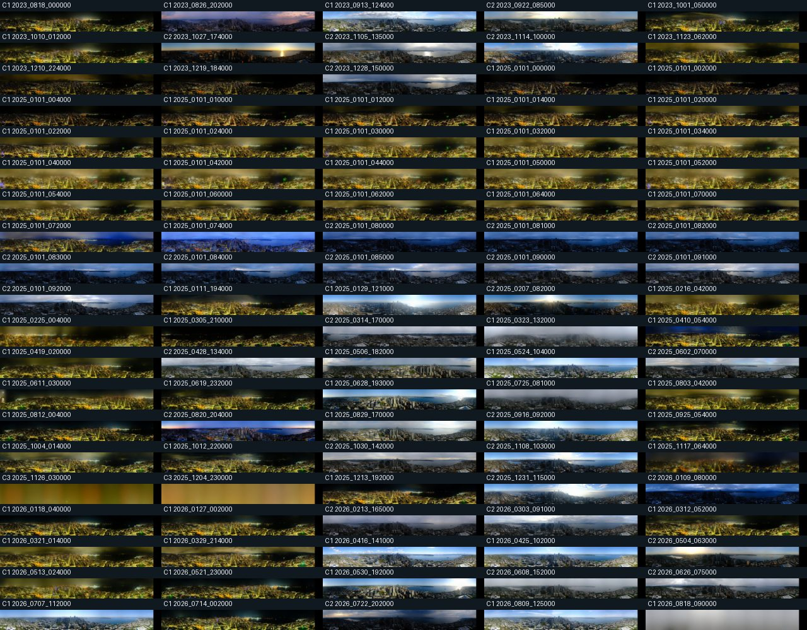

# PanoCam full-panorama clustering

Generated: `2026-08-18T16:32:16.427363+00:00`
Available timestamps in range after exclusions: **74348**
Excluded timestamps: none
Excluded dates: none
Sampled timestamps: **100**
Incomplete candidate timestamps skipped: **9**

## Method

- Downloaded all `17` numbered slices for each sampled timestamp.
- Assembled slices at their source offsets (`sliceN` at `N × 512px`) into `8704×1080` panoramas.
- Converted each panorama to grayscale, computed horizontal and vertical pixel gradients, thresholded the top 22% gradient magnitudes, and resized the edge map to 64×16.
- Ran K-means for k=2..8; selected the highest silhouette score.
- Selected **k=3** with silhouette score **0.2974**.

## Cluster summary

| Cluster | Count | Representative frames | Samples |
|---:|---:|---|---|
| 1 | 68 | `2025_0101_054000`, `2025_0101_010000`, `2025_0111_194000`, `2025_0101_030000` | [clusters/cluster-01-samples.jpg](clusters/cluster-01-samples.jpg) |
| 2 | 30 | `2025_1030_142000`, `2025_0602_070000`, `2026_0626_075000`, `2025_0101_092000` | [clusters/cluster-02-samples.jpg](clusters/cluster-02-samples.jpg) |
| 3 | 2 | `2025_1126_030000`, `2025_1204_230000` | [clusters/cluster-03-samples.jpg](clusters/cluster-03-samples.jpg) |

## Overview

The full panorama samples are in [`panoramas/`](panoramas/). The reproducible timestamp selection is in [`sample.json`](sample.json), and cluster assignments are in [`clusters.csv`](clusters.csv).
The complete full-resolution panoramas are available locally under `panoramas/`; the raw slice cache is under `raw/`. Those large generated caches are ignored from version control. The committed report includes the overview and representative cluster panels.

## Interpretation and limitations

Clusters describe visual edge-layout similarity, not semantic weather or compass classes. A cluster can combine similar skyline geometry under different lighting, and source-camera alignment changes can split visually related views across clusters.

The edge feature is intentionally simple: it is useful for exposing whether panorama layouts group together, but it is not a robust panorama-registration algorithm and does not prove a stable physical heading.
