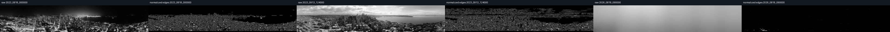

# Aggressive panorama edge registration

Input sample: `/home/pedro/src/bsky-mountain-out/reports/panorama-clusters-2026-08-18-final/sample.json` (100 panoramas)
Reference frame: `2023_0913_124000` (highest normalized edge density)
Registration shift range: `-418`..`212` feature pixels; `-1776.5`..`901.0` panorama pixels
Registration score: median `0.5584`, min `0.0000`, max `1.0000`
Reliable registrations used for consensus: **57/100** (threshold `0.25`)

## Normalization and registration

Each panorama is converted to grayscale, locally contrast-normalized with CLAHE, high-pass filtered to remove day/night illumination, and processed with aggressive Canny plus high-percentile Scharr edges. Morphological closing preserves broken avenue, skyline, and shoreline edges without filling neighborhoods.

Horizontal alignment uses SIFT feature matching on the CLAHE-normalized grayscale panoramas, with Lowe ratio filtering, vertical-delta filtering, and a robust median horizontal translation constrained to the configured search window. The registered edge maps are then used for consensus and clustering.

## Structural landmarks

The Hough detector reports long near-vertical consensus edges in `landmarks.json`. These are candidate avenue/building edges after registration; they are not yet labeled geographically.

The consensus edge image is available at [`consensus-edges.png`](consensus-edges.png).
### Manual landmark labeling

Please label the red candidates **A–E**. The circles intentionally mix long avenue/building edges, the downtown skyline anchor, and Elliott Bay/shoreline boundaries; these labels will let the next pass map structural coordinates to the Rainier-facing direction.

## Edge clusters

K-means over the registered edge maps selected **k=2** with silhouette score **0.5179**.

| Cluster | Count | Representative frames | Samples |
|---:|---:|---|---|
| 1 | 97 | `2025_0101_020000`, `2026_0707_112000`, `2026_0714_002000`, `2026_0513_024000` | [clusters/cluster-01-aligned-samples.jpg](clusters/cluster-01-aligned-samples.jpg) |
| 2 | 3 | `2026_0818_090000`, `2025_1126_030000`, `2025_1204_230000` | [clusters/cluster-02-aligned-samples.jpg](clusters/cluster-02-aligned-samples.jpg) |

## Conclusion

The aggressive edge representation substantially suppresses day/night color and exposure differences, but the registration score and consensus image should be inspected before using the resulting shift as a production crop. Stable avenues and the Elliott Bay shoreline are viable geometric anchors; the next step is to label those consensus landmarks and estimate Rainier's bearing from clear mountain frames.

This experiment demonstrates structural grouping and horizontal registration. It does not yet claim an automatically verified Rainier direction.
